# PromQL for Humans

PromQL is a built in query-language made for Prometheus. Here at Timber, [we've found Prometheus to be awesome](https://timber.io/blog/prometheus-the-good-the-bad-and-the-ugly/), but PromQL difficult to wrap our head around. This is our attempt to change that.

## Basics

### Instant Vectors

_Only Instant Vectors can be graphed._

`http_requests_total`

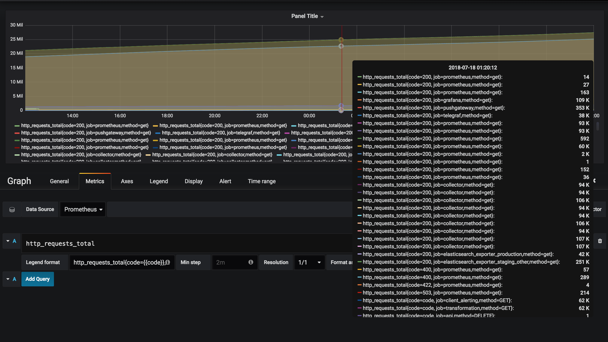

This gives us all the http requests, but we've got 2 issues.
1. There are too many data points to decipher what's really going on.
2. You'll notice that `http_requests_total` only goes up, because it's a counter. These are common in Prometheus, but not useful to graph.

We'll show you what to do about both these issues.

It's easy to filter by label.

`http_requests_total{job="prometheus", code="200"}`

`!=` -- not equal

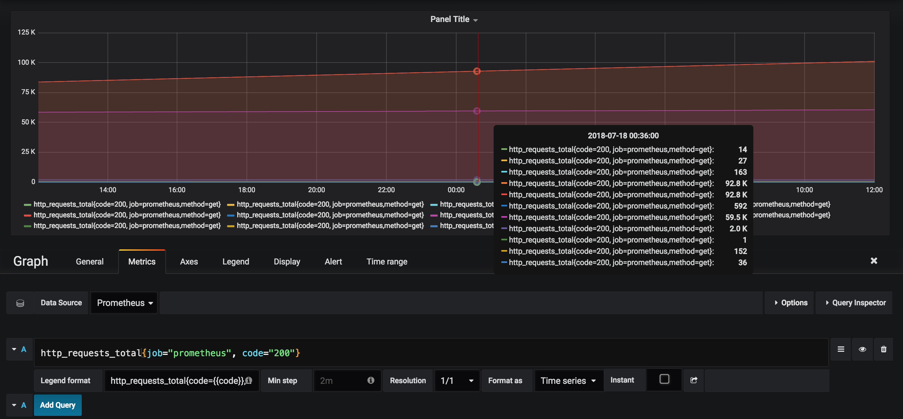

You can check a substring using regex matching.
`http_requests_total{status_code=~"2.*"}`

`!~` -- does not regex match

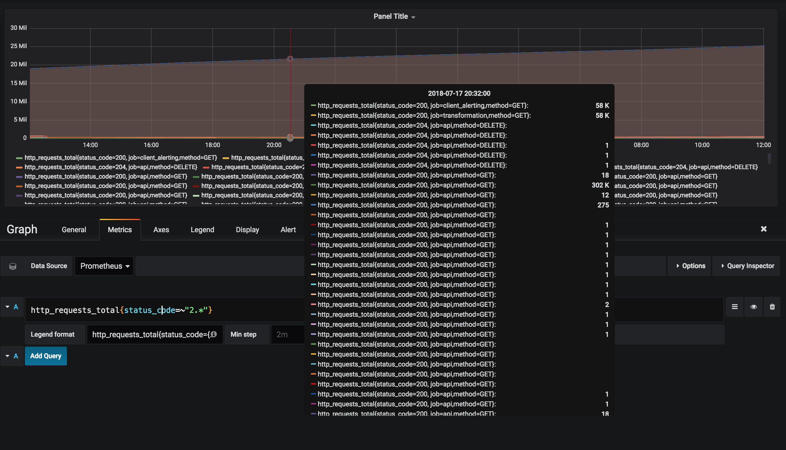

If you're interested in learning more, [here](https://docs.python.org/3/library/re.html) are the docs on Regex.

### Range Vectors

_Contain data going back in time._

Recall: Only Instant Vectors can be graphed. You'll soon be able to see how to visualize Range Vectors using functions.

`http_requests_total[5m]`

You can also use (s, m, h, d, w, y) to represent (seconds, minutes, hours, ...) respectively.

## Important functions

### For Range Vectors

_You'll notice that we're able to graph all these functions. Since only Instant Vectors can be graphed, they take a Range Vector as a parameter and return a Instant Vector._

`rate(http_requests_total[5m])` - increase of `http_requests_total` averaged over the last 5 minutes. Use this when alerting because it creates a smooth graph.

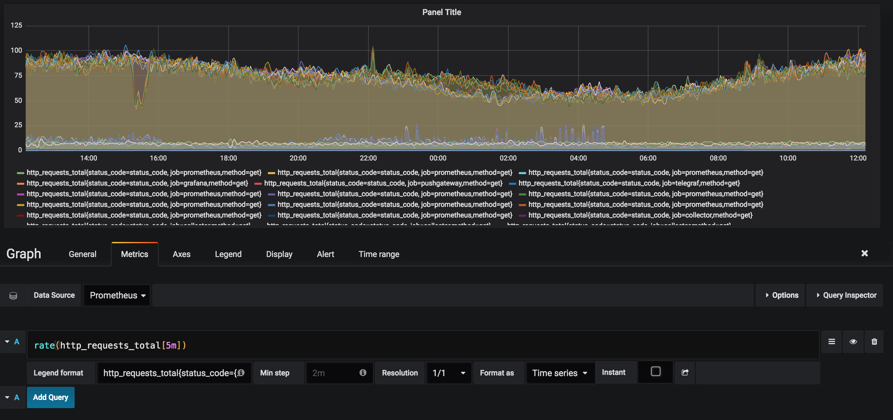

`irate(http_requests_total[5m])` looks at the 2 most recent samples (up to 5 minutes in the past), rather than averaging like `rate`. You'll notice this creates a sharp graph, so you shouldn't alert on this. _Alert fatigue is real._

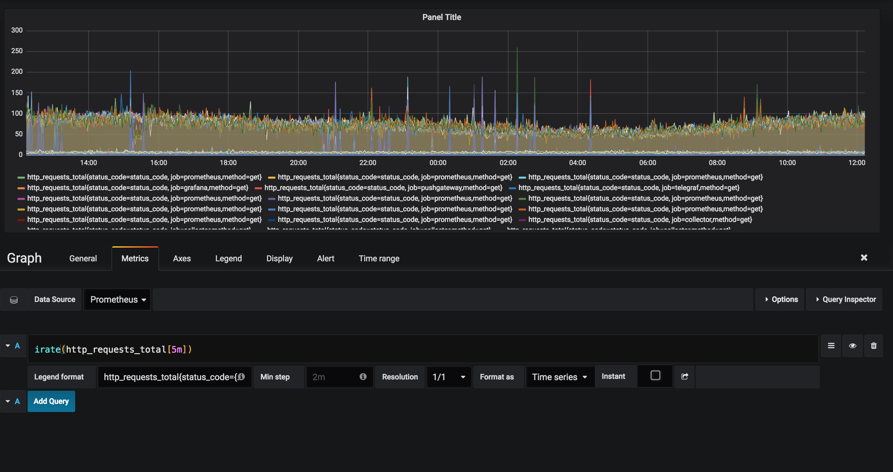

`increase(http_requests_total[1h])` - # of http requests in the last hour. This is equal to the `rate` * # of seconds.

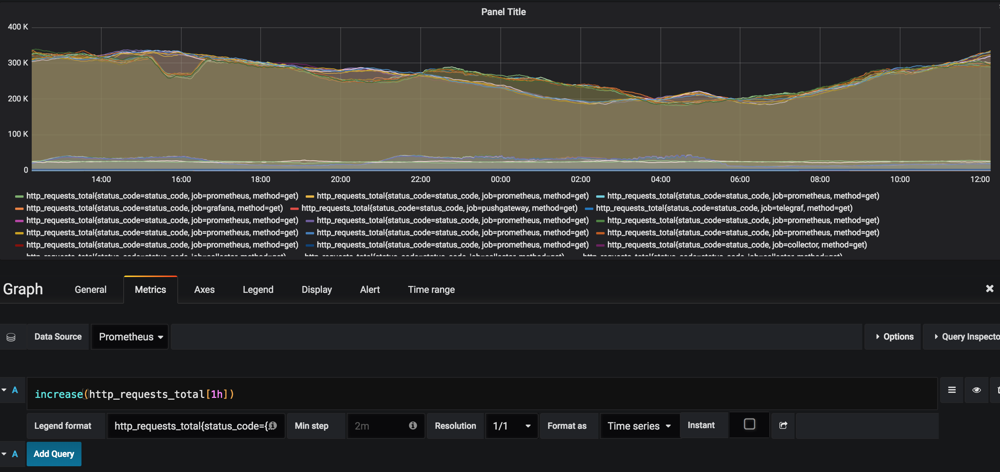

These are a small fraction of the functions, just what we found most popular. You can find the rest [here](https://prometheus.io/docs/prometheus/latest/querying/functions/).

### For Instant Vectors

You'll notice that `rate(http_requests_total[5m])` above provides a ton of data. You can filter that data using your labels, but you can also look at your system as a whole using `sum` (or do both).

`sum(rate(http_requests_total[5m]))`

You can also use `min`, `max`, `avg`, `count`, and `quintile` similarly.

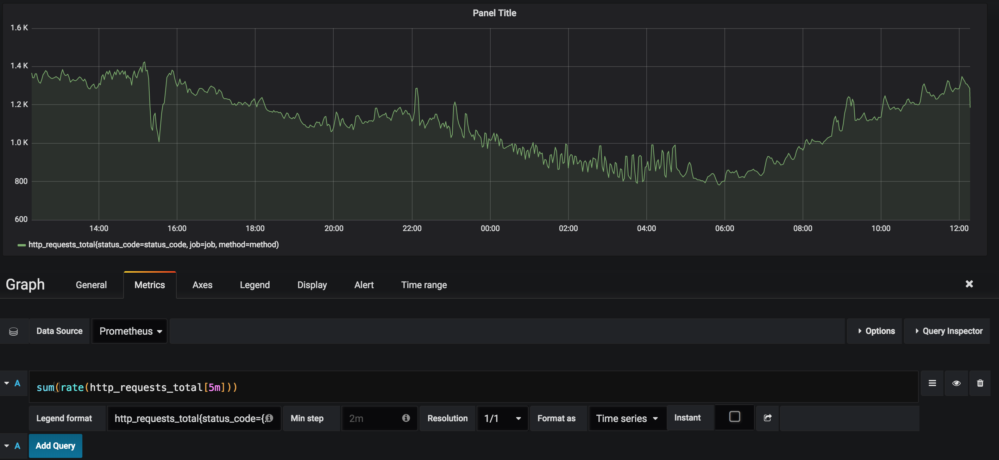

This tells you how many total HTTP requests there are, but some are obviously more indicative of others.

`sum by(status_code) (rate(http_requests_total[5m]))`

You can also use `without` rather than `by` to sum on everything not passed as a parameter to without.

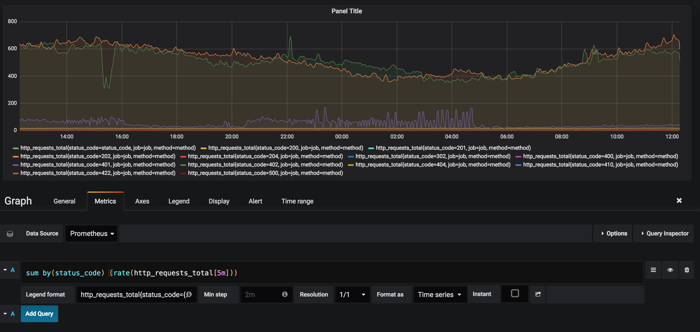

Now, you can see the difference between each status code.

### Offset

You can use `offset` to change the time for Instant and Range Vectors. This can be helpful when comparing current to past usage when determining to trigger an alert.

`sum(rate(http_requests_total[5m] offset 5m))`

Remember to put `offset` directly after the selector.

## Operators

Operators can be used between scalars, vectors, or a mix of the two. Operations between vectors expect to be able to find matching elements for each element on the other side (also known as one-to-one matching), unless otherwise specified.

There are Arithmetic (+, -, \*, /, %, ^), Comparison (==, !=, >, <, >=, <=) and Logical (and, or, unless) operators.

### Vector Matching

#### One-to-One

Vectors are equal i.f.f. the labels are equal.

API 5xxs have increased by 20% over the past 5m
`rate(http_requests_total{status_code=~"5.*"}[5m]) > .1 * rate(http_requests_total[5m])`

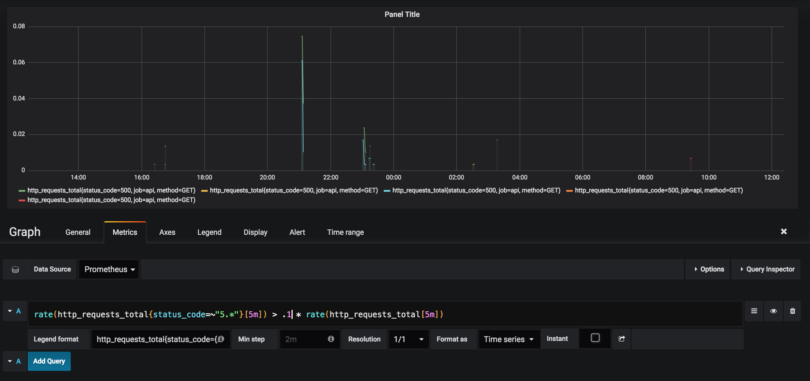

We're looking to graph whenever more than 10% of an instance's HTTP requests are errors. Before comparing rates, PromQL first checks to make sure that the vector's labels are equal.

You can use `on` to compare using certain labels or `ignoring` to compare on all labels except.

#### Many-to-One

It's possible to use comparison and arithmetic operations where an element on one side can be matched with many elements on the other side. _You must explicitly tell Prometheus what to do with the extra dimensions._

You can use `group_left` if the left side has a higher cardinality, else use `group_right`.

## Before You Go

Just wanted to catch you before you finished reading to let you know we're a cloud-based logging company that's looking to make debugging easier by seamlessly augmenting logs with context. We've got a great product built and you can check it out for free!

## Examples

_CPU Usage by Instance_

`100 * (1 - avg by(instance)(irate(node_cpu{mode='idle'}[5m])))`

This provides the average CPU Usage per instance for a 5 minute window.

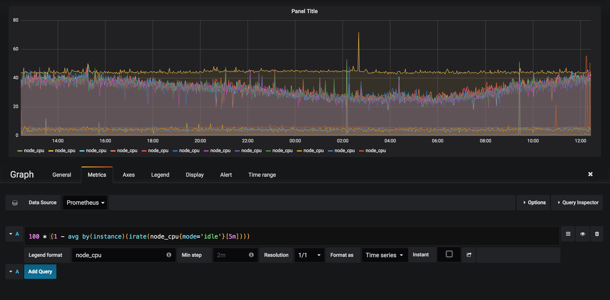

_Memory Usage_

`node_memory_Active / on (instance) node_memory_MemTotal`

Percentage of memory being used by instance.

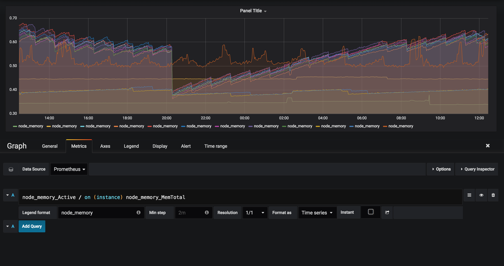

_Disk Space_

`node_filesystem_avail{fstype!~"tmpfs|fuse.lxcfs|squashfs"} / node_filesystem_size{fstype!~"tmpfs|fuse.lxcfs|squashfs"}`

Percentage of disk space being used by instance.

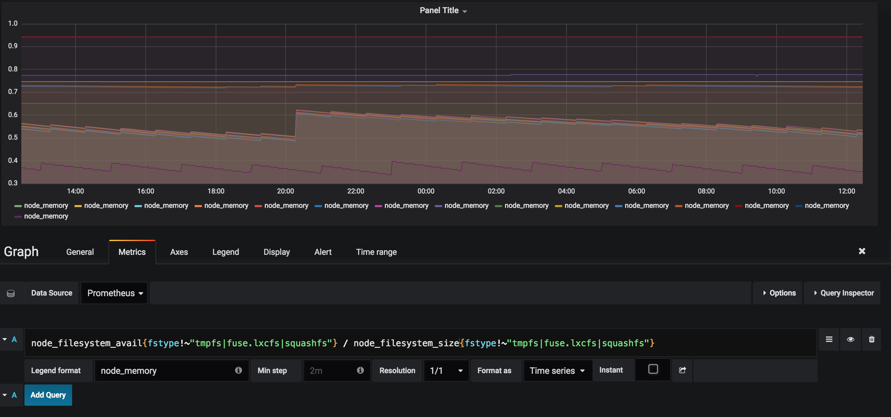

You can find more great examples [here](https://github.com/infinityworks/prometheus-example-queries).
