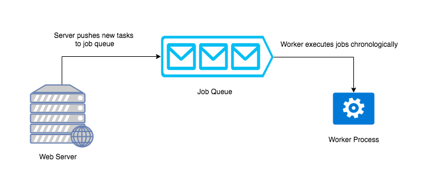
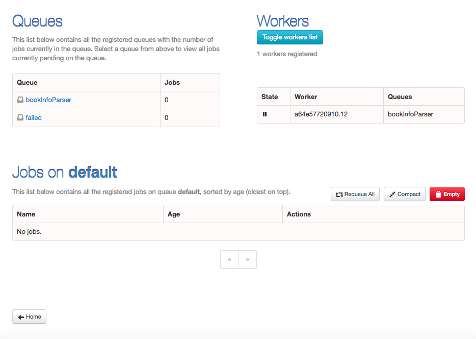
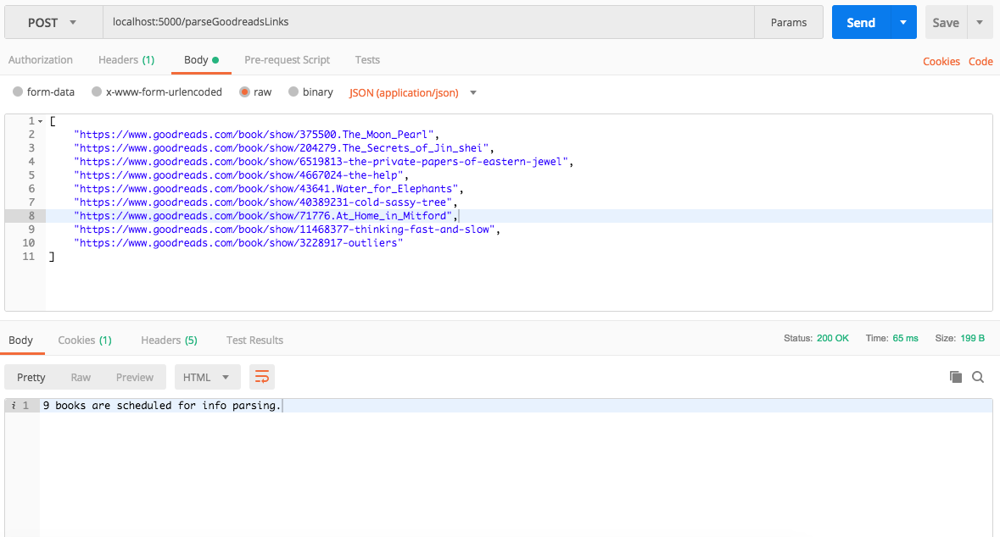
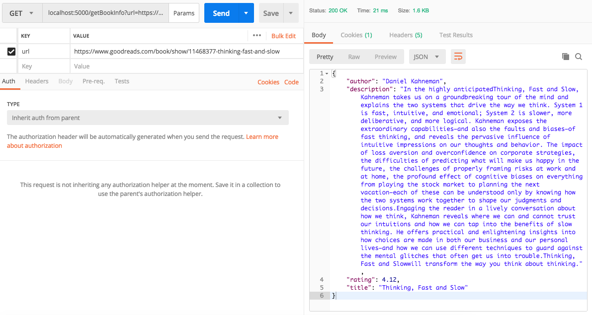

# Running background tasks in Python using task queues

We often come across problems in our applications where a compute-intensive time-taking task needs to be performed on the server in response to some user activity or request. For a server-side application exposing a REST API, handling this problem is different from common CRUD endpoints where request-response lifecycle is usually short. In this case, the response for such a request may not be available, as it may be not viable to proceed with its execution immediately on the same process.

The execution of such tasks or jobs can be performed in the background by some another process spawned for the sole purpose. These processes are usually called _workers_. They run concurrently with the main process (web server in our case) handling client requests. To list of all the tasks which need to be executed, a job/task queue is maintained to store tasks along with its metadata created by incoming requests on the web server. The worker process then executes these tasks chronologically. This modular approach makes it easier for the web server to accommodate execution of such long-running tasks as it will not get blocked itself in doing so. This also means that the web server can respond to forthcoming client requests.



Task queues are quite popular among microservices architecture. They enable each microservice to perform its definite task really well and take care of the complexities of inter-microservice communication.

## Queueing frameworks to the rescue

Let's have a look at some of the popular job queuing frameworks.

### [Celery](http://www.celeryproject.org/)

This is undoubtedly one of the most popular tasks queuing frameworks in Python. It has a wide community support and it is recommended for high-velocity production applications. It offers both asynchronous and synchronous mode with support of multiple worker processes. RabbitMQ, Redis, Beanstalk are some of the message brokers supported.

### [AWS SQS](https://aws.amazon.com/sqs/)

Amazon Web Services (AWS) provides a fully managed queuing service called Simple Queueing Service. It can be readily used with any existing application without the need for deploying or managing the queuing service. AWS provides SDKs for many popular languages making it a language agnostic solution. It has recently got the support of AWS lambda functions which makes it suitable for a serverless architecture. Now a lambda function can execute the tasks present in SQS, acting as a worker.

### [Redis Queue](http://python-rq.org/)

Redis Queue (RQ) is a python library which implements a simple job queue using Redis. It's a lightweight alternative that derives the good parts from existing queueing frameworks. A single worker process can be pointed to many queues to execute the tasks. We will be using this in the following application for its simplicity.


There are many other queueing frameworks or services available. Refer [queues.io](http://queues.io/) to discover more.

## Real World Application

We will be writing a flask-based web application which uses Redis Queue (RQ) python library for executing asynchronous tasks. The web server exposes an endpoint that accepts Goodreads book URLs. A function will parse this URL for meta information of the book like title, author, rating, etc. The function will execute asynchronously by a separate worker process. It requires a Redis server as a message broker for performing this operation. Let's get into the code and learn how we can use Redis queue in our web applications.

For bootstrapping the development and avoiding the hassles of setting up the project from scratch, you can use the starter repo here to follow along. This starter application requires Docker to be installed on your machine. To do so, you can head out [here](https://www.docker.com/community-edition) and install the relevant version depending upon your environment.

### Setup the starter application

First, clone the repository by running the following command in a terminal:

```
git clone https://github.com/divyanshutomar/flask-task-queue.git
```

To check if everything is working fine, start Docker daemon and run `docker-compose up --build` to start the application. This launches two containers, our web server application and Redis server interlinked with each other using Docker networking. The `--build` argument makes sure the image is built using the latest code every time while running the containers. Visit `localhost:5000` in a browser to check if web service is working fine. This is the default URL that Gunicorn runs our flask application on.


### Getting to Know Starter Application

The starter application uses python based web framework called *Flask*. It will be used for exposing the REST API endpoints. The flask application is served using the *Gunicorn* HTTP server. We use *honcho* to start our web application as it allows us to run multiple processes at the startup. It uses Procfile for specifying the processes that need to be run. Currently, only Gunicorn is started using honcho.


*Pipenv* is used for managing the python dependencies and environment. We use *Docker* for containerising and running our application in an isolated environment. Dockerfile lets us specify how our application should be run. Docker compose lets us orchestrate multiple containers (flask web server and Redis server in our case) to run together and be able to communicate with each other.

### Writing the parser

Let's start with writing a simple parser that accepts a Goodreads book page URL. We will be using requests python library for making an HTTP request to get HTML content of the page. BeautifulSoup is a python library that lets us search, manipulate and create structured markup languages such as HTML, XML, etc. It will create a searchable tree from the fetched page's HTML. This will allow us to retrieve key information like the book title, author, rating, and description.

```python
# server.py

def parse_book_link_for_meta_data(bookLink):
  htmlString = requests.get(bookLink).content
  bsTree = BeautifulSoup(htmlString,"html.parser")
  title = bsTree.find("h1", attrs={"id": "bookTitle"}).string
  author = bsTree.find("a", attrs={"class": "authorName"}).span.string
  rating = bsTree.find("span", attrs={"itemprop": "ratingValue"}).string
  description = ''.join(bsTree.find("div", attrs={"id": "description"}).find("span", attrs={"style": "display:none"}).stripped_strings)
  return dict(title=title.strip() if title else '',author=author.strip() if author else '',rating=float(rating.strip() if rating else 0),description=description)
```

We can now write a function that calls the above parsing function and persists the value to Redis so that it can be retrieved later. This function along with its arguments will be pushed to queue so that the worker process can execute it.

```python
# server.py

generate_redis_key_for_book = lambda bookURL: 'GOODREADS_BOOKS_INFO:' + bookURL

def parse_and_persist_book_info(bookUrl):
  redisKey = generate_redis_key_for_book(bookUrl)
  bookInfo  = parse_book_link_for_meta_data(bookUrl)
  redisClient.set(redisKey,pickle.dumps(bookInfo))
```

### The endpoint for accepting URLs

Let's set up an endpoint that will accept a list of valid Goodreads book URLs. This is going to support POST method with URLs accepted as an array in _application/json_ body format. All valid book URLs will be scheduled for meta information parsing by enqueuing the parse function to Redis queue. 

```python
# server.py

# Endpoint that accepts an array of Goodreads URLs for meta information parsing
@app.route('/parseGoodreadsLinks', methods=["POST"])
def parse_goodreads_urls():
  bodyJSON = request.get_json()
  if (isinstance(bodyJSON,list) and len(bodyJSON)):
    bookLinksArray = [x for x in list(set(bodyJSON)) if x.startswith('https://www.goodreads.com/book/show/')]
    if (len(bookLinksArray)):
      for bookUrl in bookLinksArray:
        bookInfoParserQueue.enqueue_call(func=parse_and_persist_book_info,args=(bookUrl,),job_id=bookUrl)
      return "%d books are scheduled for info parsing."%(len(bookLinksArray))
  return "Only array of goodreads book links is accepted.",400
```
Here the returned response specifies the number of jobs (parsing of book information in this case) scheduled.

### The endpoint for retrieving book information

An endpoint that will request the Redis server for value (book information) of a key corresponding the URL received from the request. If the key is set, return a JSON response containing book information.

```python
# server.py

# Endpoint for retrieving book info from Redis
@app.route('/getBookInfo', methods=["GET"])
def get_goodreads_book_info():
  bookURL = request.args.get('url', None)
  if (bookURL and bookURL.startswith('https://www.goodreads.com/book/show/')):
    redisKey = generate_redis_key_for_book(bookURL)
    cachedValue = redisClient.get(redisKey)
    if cachedValue:
      return jsonify(pickle.loads(cachedValue))
    return "No meta info found for this book."
  return "'url' query parameter is required. It must be a valid goodreads book URL.",400
```

### Inspecting task queue

The creators of Redis queue (RQ) library have developed another library for checking the state of Redis queue. It is called *rq-dashboard* and it can be integrated with our flask web application. It exposes a flask blueprint for integrating with an existing flask project. It's a browser-based application which shows queues status,  workers listening on those queues and jobs queued along with their meta information. Also, it provides triggers for flushing the queue and re-queuing failed jobs.



### Testing the application

Now, we are all set to begin testing our application with some Goodreads URLs. Let's start by making a POST request to `/parseGoodReads` endpoint. Make sure to provide a valid list of URLs in an array as the request body.



We can check for the tasks scheduled by navigating to rq dashboard endpoint `/rqstatus`. The dashboard provides a very intuitive interface for visualising the queue in realtime as tasks are scheduled and executed by a worker process. It also helps in inspecting the error stack trace for any failed tasks.


Once the queue becomes empty and all tasks are executed successfully, we can check for the meta information. To do so, make a GET request to `/getBookInfo` endpoint with an URL query parameter having the value set as one of the URLs from previous POST request. This returns a JSON response containing information like title, author, rating and description.



You can view the full code [here](https://github.com/divyanshutomar/flask-task-queue/tree/completed).

## Conclusion and Takeaways

The above application demonstrates how queuing frameworks like Redis Queue can be leveraged for solving problems that need more time and computing resources. In our application, if the parsing task is executed on the same process where client requests are being processed and served, it can easily become a performance bottleneck with high traffic. The above approach not only helps in avoiding that but also bring modularity to the table. Following are some of the key takeaways you can follow to tackle similar problems:
* Queueing frameworks allows more granular control over scaling of different processes. More worker processes can be spawned if there is an accumulation of a large number of tasks in the queue.
* Multiple queues can be used for handling different type of tasks.
* Every task can send some meta information about its status or progress so far to Redis. This information can be useful for getting an insight into a task that runs for a long duration.

Thanks for following along and I hope this post would have been useful for you.